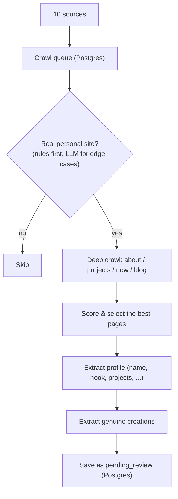
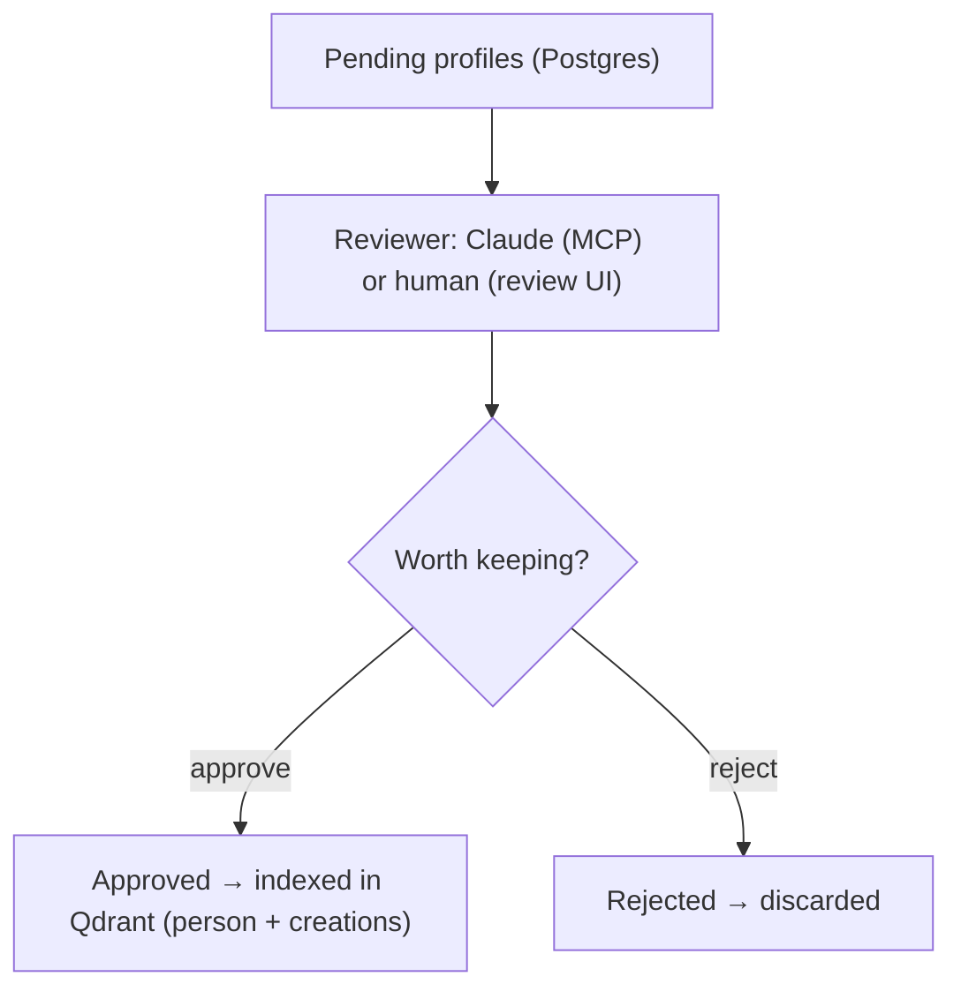
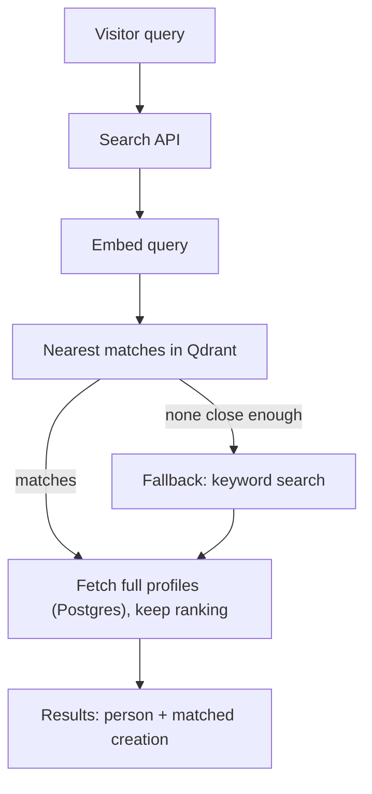

# Architecture

quiethumans has three stages: **Crawl** (find people and extract what they make),
**Curate** (decide who is worth keeping), and **Retrieve** (semantic search). The
guiding constraint is editorial: only index people who build genuinely distinctive
things. The design choice is *where* that judgment lives — not in the crawler, but in a
separate curation step performed by a stronger model.

---

## 1. Crawl

Candidate URLs are gathered from sources where indie builders congregate (personal-site
directories, webrings, Hacker News, Reddit, GitHub lists) into a Postgres queue. Each URL
is processed independently and saved as `pending_review`. The crawler does **not** decide
who is interesting — it only confirms a URL is a real personal site and records what the
person makes.

| Step | Decision | Method |
|------|----------|--------|
| Classify | Is this one person's site (not a company/shop/docs)? | Fast rule-based filters; the LLM is consulted only for ambiguous cases. |
| Crawl | What does this person do? | Follows the pages that reveal a person — about, projects, now, writing. |
| Score | Which pages are worth reading closely? | Heuristic pre-filter, then LLM ranking. |
| Extract | A structured profile | LLM fills name, hook, projects, interests, category. |
| Creations | What did they actually make? | A dedicated "creation, not opinion" filter (see below). |

A small, self-hosted model runs all of this — fast and cheap, suited to high volume.

---

## 2. Curate

The pending pool is reviewed by a stronger model (a Claude client) over a token-gated MCP
server, or by a human through a review UI. Approval is the moment a person becomes public:
only then are they and their creations embedded and indexed for search. Rejection discards
the staged data.

**Cheap model for volume, strong model for judgment.** The self-hosted model handles
crawling and extraction at scale; the keep/reject call — where judgment matters most — is
made by a stronger model or a human.

### The "creation, not opinion" filter

A two-step test decides which of a person's works are worth indexing:

1. **Is it a real creation?** A tangible thing the person made and shipped (app, tool,
   library, game, hardware, published book/album/art series, research, course) — *not* an
   opinion post, review, how-to guide, life update, or repost. This binary call is reliable
   even on small models.
2. **Does it have a creative spark?** Kept if it is novel, original, playful, technically
   crafted, or a clever solution to the person's own problem — *even with little practical
   utility*. Dropped only if it is generic: a plain blog, bare config, a by-the-numbers
   exercise, or mostly an employer's team work.

The thresholds and concrete keep/drop patterns in this filter were tuned empirically by
comparing model judgments against a labeled set, so the cheap model's decisions track the
stronger models'.

---

## 3. Retrieve

Search matches on *meaning*, not keywords, using the embeddings produced at approval. Both
people and their individual creations are indexed, so a query can surface the person and
the specific work that matched.

- **Meaning first, keywords as a fallback** so results are relevant but the page is never
  empty.
- **Two stores, distinct roles.** Qdrant answers "who is similar to this query?"; Postgres
  holds the authoritative profile. Hits are de-duplicated to the person, with the matched
  creation surfaced alongside. Only approved people are ever indexed.

---

## Summary

PostgreSQL for the facts, Qdrant for semantic similarity, a cheap self-hosted model for
crawling and extraction, a stronger model (or human) for curation, and a React frontend on
top. See [SCHEMA.md](SCHEMA.md) for the data model.
